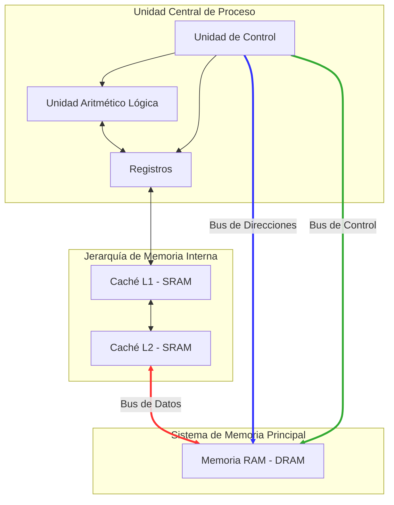

# Anatomía de la computación: del flujo interno del hardware a la arquitectura distribuida

**Practica y Experimentación**

**Nicolas A. Cevallos**  
Universidad Internacional del Ecuador  
Ingeniería en Tecnologías de la Información  
Arquitectura e Integración de Plataformas de TI  
**Mgs. Richard F. Armijos**  
Mayo 15, 2026  

---

## 1. Introducción: ¿Por qué un arquitecto de software debe saber cómo funciona un bus de datos?
La arquitectura de software no opera en un vacío teórico; está restringida por las leyes físicas del hardware subyacente. Comprender el funcionamiento de los buses de datos, direcciones y control permite al arquitecto visualizar cómo la información transita a nivel de pulsos eléctricos. Esta comprensión es vital porque los cuellos de botella que ocurren a nivel de microprocesador (como la espera por datos de la RAM) son conceptualmente idénticos a los problemas que enfrentamos al diseñar sistemas distribuidos, donde el "bus" se convierte en una red de área local (LAN) o internet. Un arquitecto que ignora la latencia física terminará diseñando sistemas ineficientes y costosos, ignorando que el rendimiento final es siempre una función de la velocidad del flujo de datos.

## 2. Mapa de Arquitectura: El Modelo de Von Neumann
A continuación, se presenta la disección arquitectónica del sistema de cómputo. En el diagrama de flujo de datos, los buses se diferencian visualmente para identificar su naturaleza: **Bus de Datos** (Bidireccional para lectura/escritura), **Bus de Direcciones** (Unidireccional desde la CPU) y **Bus de Control** (Unidireccional para señales de sincronización).

**Flujo de ejecución de la instrucción:**
1. **Captura (Fetch):** La Unidad de Control coloca la dirección de la instrucción en el Bus de Direcciones y activa la señal de lectura en el Bus de Control.
2. **Transporte:** La instrucción viaja por el Bus de Datos desde la RAM hacia los registros.
3. **Decodificación y Ejecución:** La Unidad de Control interpreta la instrucción y activa la ALU para procesar los datos, devolviendo el resultado a los registros o a la memoria a través del bus de datos.

## 3. Análisis Técnico: Los Buses y el Cuello de Botella de Von Neumann
El "cuello de botella de Von Neumann" es el límite físico al rendimiento que surge de la separación entre la CPU y la memoria. Aunque la CPU puede procesar miles de millones de instrucciones por segundo, está obligada a esperar a que los datos lleguen a través del bus del sistema, cuya velocidad es órdenes de magnitud inferior. 

Para cuantificar este impacto, se presenta la siguiente tabla comparativa de latencias reales:

| Componente | Tiempo de Acceso (Latencia) | Comparación Relativa |
| :--- | :--- | :--- |
| **Registros CPU** | ~ 0.5 ns | Inmediato |
| **Caché L1** | ~ 1 ns | 2x más lento |
| **Caché L2** | ~ 4 ns | 8x más lento |
| **Memoria Principal (RAM)** | ~ 100 ns | **200x más lento** |

Este retraso implica que la CPU pasa la mayor parte de su tiempo "ociosa", esperando datos. En la computación moderna, este problema se mitiga con la jerarquía de cachés y técnicas de ejecución especulativa, pero el límite físico persiste.

## 4. Escalabilidad: Del Bus a la Red Distribuida
Cuando pasamos de una placa base a un sistema en la nube, el bus de cobre es reemplazado por la red. Los problemas de flujo de datos se multiplican debido a las **Falacias de la Computación Distribuida** de Peter Deutsch.

1.  **La red es confiable:** A diferencia de un bus interno donde la pérdida de bits es casi nula, en un sistema distribuido los paquetes se pierden o llegan fuera de orden. Un arquitecto debe diseñar asumiendo que el "bus de red" fallará.
2.  **La latencia es cero:** Esta es la falacia más peligrosa. Si la RAM es 200 veces más lenta que la CPU, un servidor en otra región puede ser **millones de veces más lento**. Ignorar esto al diseñar llamadas sincrónicas colapsa la escalabilidad del sistema.

## 5. Reflexión del Autor
La investigación sobre la arquitectura de Von Neumann me permitió comprender que las limitaciones que enfrentamos hoy en microservicios no son nuevas, sino una escala mayor de problemas físicos que ya ocurrían en 1945. Lo más complejo fue diferenciar visualmente la lógica de los tres buses en el diagrama Mermaid; inicialmente, el flujo parecía una sola línea de conexión, pero al profundizar entendí que la Unidad de Control gobierna el flujo mediante el bus de direcciones de forma independiente al transporte de datos. Para esta práctica utilicé IA como apoyo en la generación del esquema visual, sin embargo, realicé correcciones manuales críticas, ya que la herramienta generaba errores de renderizado en los índices de los buses y no diferenciaba correctamente la unidireccionalidad del bus de direcciones, un concepto fundamental para evitar errores de arquitectura en el flujo de la instrucción.

## 6. Bibliografía
Hennessy, J. L., & Patterson, D. A. (2017). *Computer Architecture: A Quantitative Approach*. Morgan Kaufmann.
Tanenbaum, A. S. (2013). *Structured Computer Organization*. Pearson Education.
Deutsch, P. (1994). *The Eight Fallacies of Distributed Computing*.
